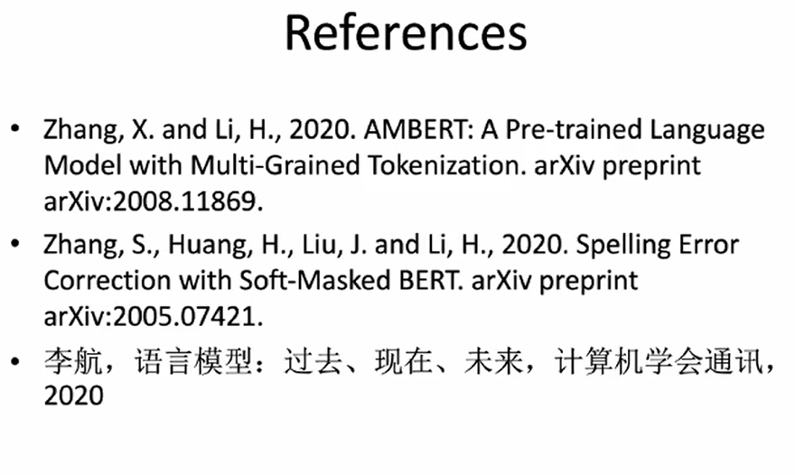
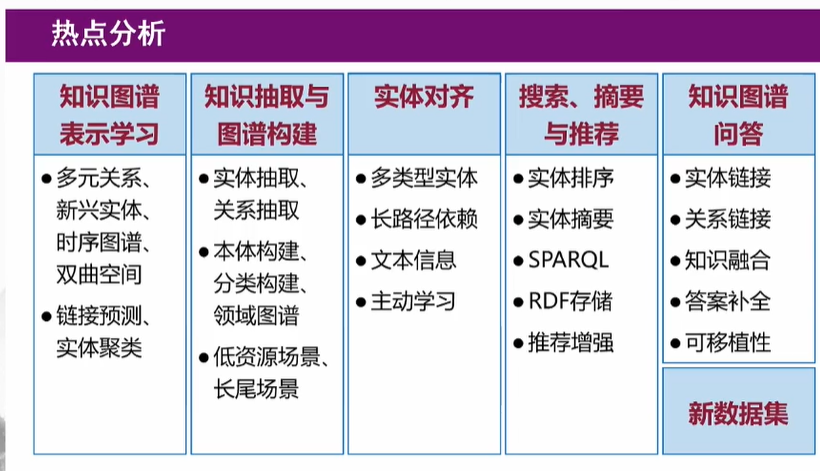
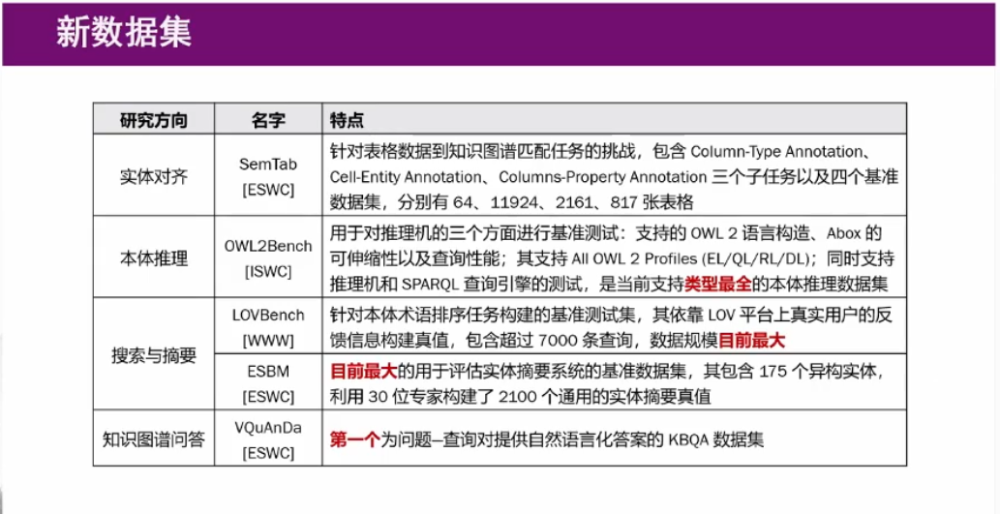

# 2020年全国知识图谱与语义计算大会  CCKS
##推语言模型的前沿研究(李航)
1. 语言模型的发展史
    - 隐马尔可夫链
        - n-gram Language Model(n-1阶马尔科夫链)
    - Entropy and Cross Entropy 
    - Chomsky hierarchy 
        - Fine state Grammer
    - Neural Language Model
        - 神经网络的参数就是语言模型的参数
        - 稠密的相对低维的实向量来表示单词 Word Embedding
        - 每个单词与周围的n-1个参数相关
    - RNN Language Model
        - LSTM
    - Pre-Trained Language Model
        - Transformer
        - Fine-tuning
    - Pretrained Language Model：GPT  语言的生成
    - Pretrained Language Model：BERT  语言的理解
2. 最近工作:Soft-Masked Bert 和 AMBERT(A Multi-Grained BERT)
    - Soft-Masked Bert 
        - 一个模型用于中文错别字的纠错
        - 基于Bert的模型没有很好的检错能力有很好的的纠错能力
        - 此模型一个检错网络：双向的GRU 一个纠错网络：Bert模型
        - 检错网络计算每个字是否是错别字的概率，将这个概率传递给纠错网络，用于bert进行mask
    - AMBERT
        - 一个新的预训练模型的方法，用多颗粒度的词和字做语言模型
        - 字粒度和词粒度，使用两个BERT，一个是字粒度和词粒度，一起做训练，参数共享(能更好的看字和词)。然后进行模型好的拼接。
3. 展望
    - 预训练语言模型的优缺点
        - 在模仿人怎么使用语言，在交叉熵的意义上更逼近人的语言
    - 两个方向
        - 语法的角度、词汇的角度
        - 多模态的方向，一个语言的形成是多模态的
    -     

## 知识图谱研究进展至自然语言处理角度
1. 三大会
    - ACL 
    - 关系、实体、知识图谱表示这方面工作的文章增加
2. 实体相关的研究
    - 多模态NER
        - 图片的视觉信息和文本的信息进行统一的建模
        - 利用代码中含有的丰富的信息来加强StackOverFlow上帖子文本的命名实体识别
    - 低资源NER    
        - 跨领域
            - 不用领域信息的共通性，实现知识迁移
            - 基于不同领域实体类型相对稳定(例如人名地名)的现象，提出了multi-cell composition LSTM结构
        - 跨语言 
            - Teacher-Student Model
            - unlabeled data in target language
    - Weak Supervision 弱监督
        - No Labelled Data
        - Labelling functions
        - Label Aggregations      
    - 数据集的自动构建
        - Entity Trigger: A group of words in a sentence that helps to explain why humans would recognize an entity in the sentence                      
    - 联合抽取
        - 联合抽取共享NER和RE的信息，信息的利用更充分
    - 开放抽取
        - 关系抽取只能抽取文本中的一小部分信息
        - Open IE 在处理科学文本时遇到长句子和复杂句子表现不佳
        - Ruben Kruiper 结合两种系统的输出，提出半开放的关系抽取
    - 文档级的抽取
        - 利用整篇文档中的上下文信息加强关系抽取
        - 需要捕获句子间实体的复杂交互
        - Latent Structure Refinement（LSR）模型动态的学习文档级结构，并以端到端方式预测
    - 低资源的抽取
        - 从半结构化文本提取信息的工作需要=依赖给定模板，模板需要通过手工标记或远程监督获得
        - Colin Lockard 提出了一种"Zeo-Shot"开放域关系抽取的解决方案，使用基于图神经网络的方法在网页上构建文本的丰富表示
        以及它们之间的关系，使其泛化成为新的模板   
3. 模型的可解释性
    - Wang et al. 提出了一种新的可解释的医学关系预测框架，以期为医学关系越策的合理化提出了参考
4. 知识图谱的构建
    - 融合知识的预训练语言模型
        - ELMo：双向LSTM
        - GPT：单向Transformer
        - BERT：双向Transformer
        - XLNet，GPT3
    - 知识增强的预训练语言模型
        - K-BERT：知识支持的语言表示模型，可以合并特殊领域知识
        - 通过结合知识图谱，K-BERT不仅在特定领域上明显胜过BERT，而且在开放域也胜过BERT
5. 知识与推理
        - 引入知识的多跳推理
            - 对话生成模型ConceptFLow，利用常识KG来显示地对对话流进行建模
        - 知识推理提高可解释性 
6. 融合知识的NLP任务
    - 基于知识的词义消歧
    - 基于知识的对话生成
    - 基于知识的文本生成 
        - Knowledge Graph-Augemented Abstractive Summarization with Semantic Driven Cloze Reward
        - An Unsupervised Joint System for Text Generation from Knowledge Graphs and Semantic Parsing
    - 基于知识的阅读理解
        - Synonym Knowledge Enhanced Reader for Chinese Idiom Reading Comprehension
    - 基于知识的事件因果分析
        - KnowDis：Knowledge Enhanced Data Augmentation for Event Casually Detection via Distant Supervision    

## 从语义网角度看待知识图谱的最新研究
1. 2020年语义网领域三大会议：WWW、ISWC、ESWC
    - 
2. 知识图谱表示学习
    - 多元关系
        - 多元关系知识库的链接预测
        - 定义：给定n元关系和(n-1)个相关实体，预测缺失的那个实体
        - 现有工作
            - 基于翻译距离的模型->表达能力弱
            - 基于神经网络的模型 ->复杂度高
        - 本文思路：泛化张量分解（2元->n元）
            - 一个n元关系知识库->(n+1)阶知识库张量
        - 具体做法：
            - 通过tucker分解来分解原始知识库张量
            - 将核心张量W重塑为k阶张量W弧
            - 通过Tucker Ring分解来分解重塑张量W弧    
    - 新兴实体
        - 新兴实体    
            - 与知识图谱中已有实体的关联非常稀疏
        - 一个归纳式的学习表示框架
            - 适合于拥有许多新兴实体的动态知识图谱
            - 保留了基于路径的模型的可解释性推理
        - 顶点表示归纳
            - Graph Transformer编码
                - 根据邻域信息与查询关系的相关性来聚合邻域信息
        - 可解释性推理    
            - 强化学习编码
                - 使用策略梯度来解码得到通往答案实体的推理路径    
    - 时序图谱
        - 大多是现有的知识图谱表示学习模型忽略了图谱中有用的时序信息
        - 知识感知的事实
        - ATiSE
            - 使用多维加性时间序列分解来刻画实体/关系额时间演变过程
                - 时间序列 = 趋势+周期+随机
            - 考虑实体/关系表示随着实际那原话的不确定性将时序知识图谱的表示映射到多为高斯分布的空间中   
2. 知识抽取和图谱构建
    - 开放关系抽取    
        - 开放关系抽取：在无结构文本中发现实体之间的任意语义关联
        - LOREM
            - 特点：不依赖特定语言知识和外部的NLP工具
                - 利用语言一致的关系结构来提升多语言的性能
                - 使用多语言对齐的词嵌入作为关系抽取器的输入
            - 具体做法
                - 一个面向特定语言的模型
                - 一个面向多有语言的模型
                - 一个组合层      
    - 低资源知识图谱补全
        - 知识图谱补全:通过连接预测和关系抽取来填补缺失的关联
            - 低资源环境：新添加的关系通常只有很少的训练样例
        - 主要思想：利用一个对抗过程来帮助把从高资源关系所学习的知识/特征适配到不同但相关的低资源网络
        - 具体做法：加权关系对抗网络  
            - 对抗关系适配：寻找可以区分具有不同关系分布的样本的关系判别器
            - 加权关系适配：识别无关的源关系/样本并自动降低其重要性，已解决负迁移问题并鼓励正迁移
    - 长尾实体丰富
        -长尾实体
            - Freebase中约有210万个实体少于10个事实，而有7655个实体超过一千个事实
                - 幂律分布
        - 现有工作
            - 仅针对实体丰富的部分环节
            - 缺乏对长尾实体的特别处理 
        - 本文思路
            - 借助相似的流行实体和广泛可用的Web数据
                 - 要找出一个人缺少什么，就要看其他人拥有什么
                 - 一些长尾实体知识在知识库中缺乏事实，而不是在真实世界中也缺乏实体
3. 实体对齐 
    - 多类型实体
        - 实体对齐：识别不同知识图谱中支撑真实世界相同对象的实体
        - 本文动机：
            - 针对不同实体类型的对齐策略可能不同
            - 当前的实体对齐模型不能通过单一模型来对齐多类型实体
        - 本文思想：集体决策
            - 精心设计的注意力机制：有效利用共享邻居信息作为正面证据，也不会忽略重要的负面证据
        - CG-MuAlign
            - Node-level cross-graph attention：相似邻居
            - Edge-level relation-aware self-attention ：负面证据
    - 短期区别和长期依赖
        - 主要思想：捕获周围实体和多跳实体中隐含的实体之间的一些高级交互
            - 短期区别和长期依赖
        - 具体做法  
            - 长期依赖：随机游走+自注意力
            - 短期区别：GNN
    - 多上下文注意力
        - Entity matching with textual instances（数据库领域)
        - MCA(multi-context attention)
            - 主要思想：对于实体文本描述对齐，充分挖掘嵌入向量的语义上下文
            - 具体做法
                - self-attention
                - Pair-attention
                - Global-attention
                - Attribute-attention        
4. 搜索、摘要、对剑
    - 实体摘要
        - 面临挑战：当前实体摘要的质量无法满足用户的信息需求时，缺乏改进实体摘要的机制
        - DRESSED
            - 主要思想：将用户引入摘要过程，获得用户反馈
            - 交互过程："删除-替代"场景
                - 用户删除“删除项”，系统替换上“替代项”                                                            
    - 知识图谱增强推荐
        - 推荐中的冷启动问题
            - 知识图谱提供了物品之间的大量关系
                - 假设存在物品到知识图谱的映射
            - 更好的推荐很少与用户互动的全新物品
        - 本文思路：规则学习+图神经网络
            - 规则
                - user-(interacts)->Red-(singer)->Tailor Swift<-(singer)-Style
                - 捕获用户与商品的显示长程语义
            - 图神经网络
                - 保存各种关联，提供更丰富的信息      
5. 知识图谱问答
    - 基于知识图谱问答
        - 实体链接
            - PNEL
                - 主要思想：使用指针网络解决端到端的实体链接
                - 具体做法：特征工程
                    - 4 n-grams+top-L matches
                    - 对每个候选，计算9个特征，拼接成1142维向量     
    - 关系链接
        - 挑战：自然语义的歧义性、训练数据的缺乏
        - SLING
            - 主要思想：AMR、远程监督
            - 具体做法
                - 输入问题文本和AMR图
                - QMG 模块产生三种元数据
                    - AMR三元组、知识库实体和类型、答案类型预测
                - RL模块包括两种远程监督模型和两种无监督模型
                    - 整合每种模型的得分并排序
6. 新数据集
    -                                                
                
                       
        
                      
        
                                    