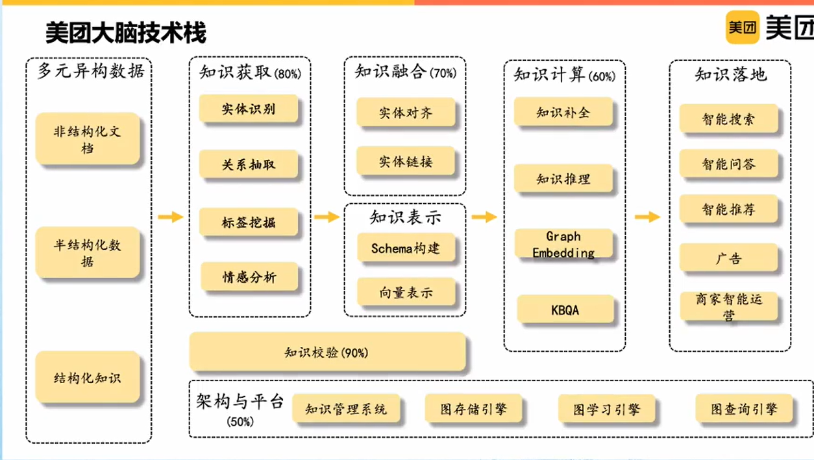
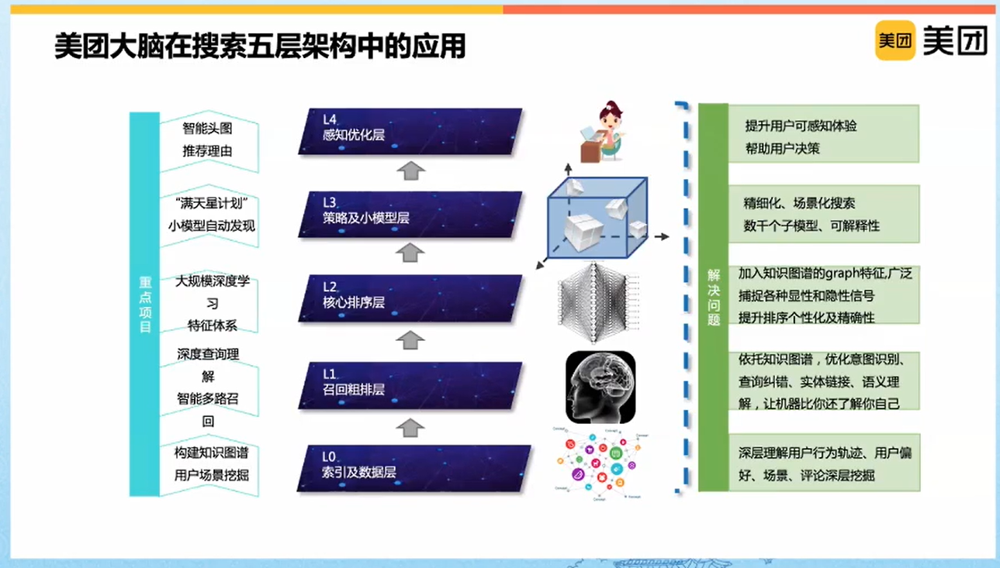
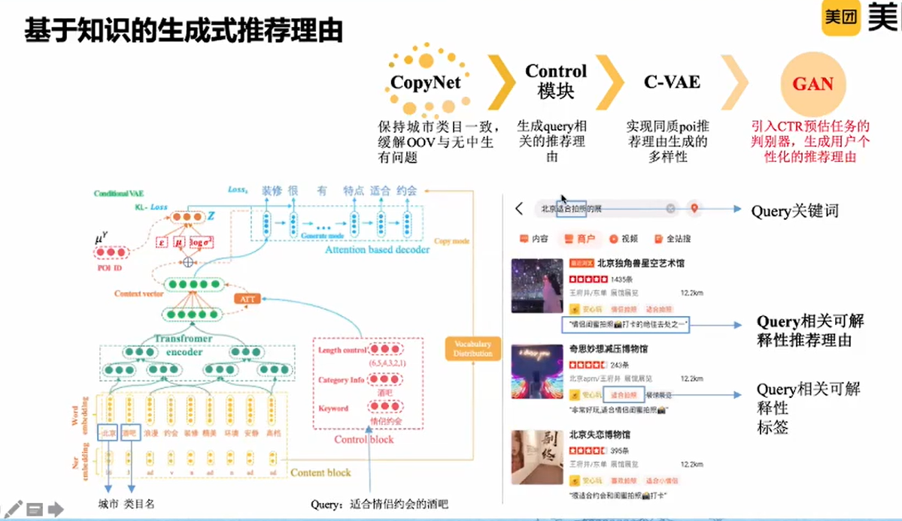
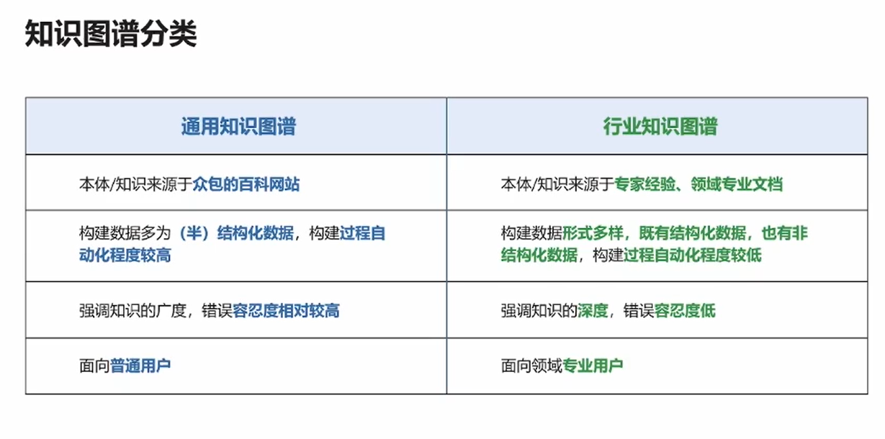
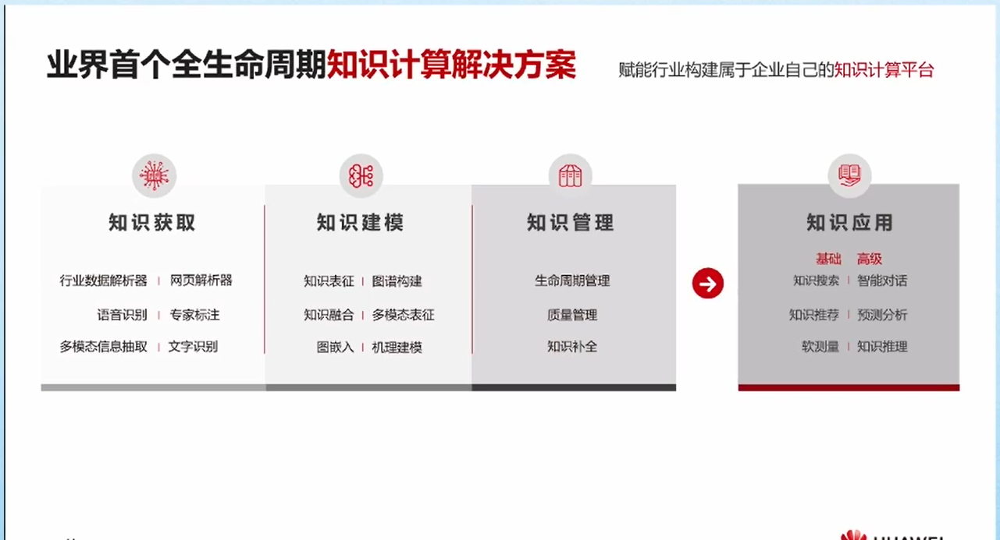
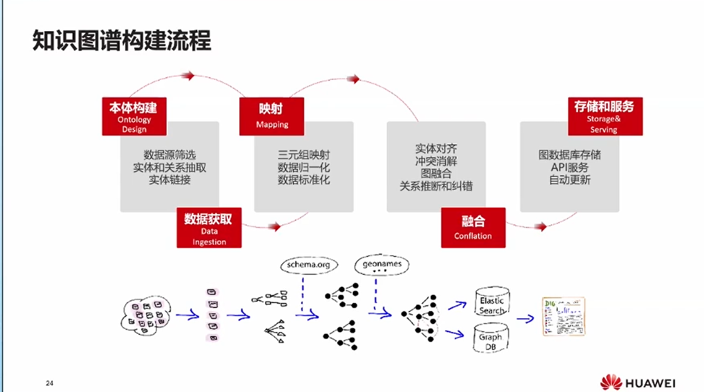
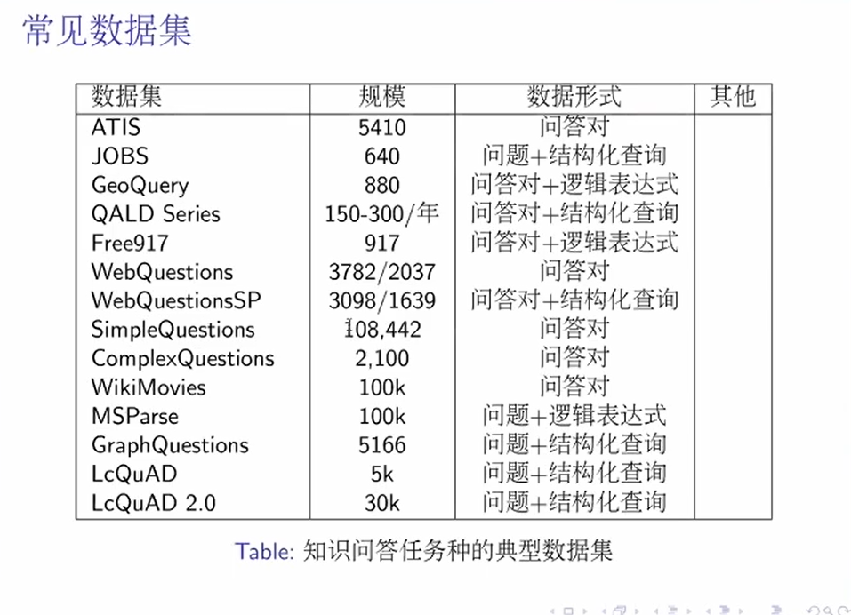

## CIPS会议笔记

### 生活服务领域知识图谱的构建
1. 
2. 知识构建
    1. 结构化数据和非结构化数据(挖掘标签和实体) 
    2. 知识抽取
        - 问题：远监督训练数据噪声 解决方法：将关系分类问题转换为关系匹配问题，采用
        *孪生网络*解决few shot 问题
        - 问题：没有考虑实体、关系之间的相互影响  解决方法：**多任务学习**解决实体、
        关系信息融合问题
        - 问题：抽取准确、召回低  解决方法：增加**实体增强关系**表示学习提升模型表达力 
        - BERT+CRF
    3. 关系挖掘
        - POI-TAG关系
            - xgboost判别模型，BERT判别模型（is-a、has-a、other）
        - TAG之间的关联关系
            - 标签图谱(同义词、上下位、修饰相关、推理相关) 
    4. 细粒度情感标签
        - 基于BERT的模型的细粒度情感分析
            - 基于不同的维度对用户的评论进行情感分析。(抽出评论的情感和维度，例可以抽出对商家停车位这个维度的评论的情感，对环境服务态度
            等)
    5. 用户知识建模
        - 有监督、无监督
        - 行为特征、文本特征、信息特征、偏好
3. 应用
    - 推荐
        1. 基于知识图谱的显示推荐
            - 基于相似的用户的相似路径进行推荐
            - 根据人群、相似标签推荐的店
            - 基于知识图谱的可解释性推荐，提高用户的决策效率
        2. 基于图谱的水波深度模型
            - 实体链接
            - 用户的兴趣在知识图谱上的扩散
            - 端到端学习个性化推荐模型
        3. 知识图谱的序列推荐
    - 搜索
        1.    
        2. 实体链接
            - 基于上下文信息的实体链接
        3. 图谱路径召回
        4. 用细粒维度筛选想去的店
    - 可解释性
        - 应用
            1. 解释召回  
               解释搜索结果与搜索query相关性解释热搜原因
            2. 亮点推荐   
               挖掘商户特色，吸引用户点击，影响用户决策
            3. 场景化承载   
                在细分场景下，进行场景化引导，同时兼具1和2的功能
            4. 体现个性化   
                多样性，千人千面，自动生成，无人工干预
        - 构建
            1. 基于图谱路径的推荐理由（由用户到POI的路径，人群聚合等）
            2. 基于知识的生成式推荐理由
                - 
                  
        - 知识图谱可视化   
    - 知识图谱问答
        - 智能助理、搜索问答、复杂条件找店
        - 问答技术分类
            - 按数据来源划分
                - 基于知识库的问答 KBQA
                - 基于文档的问答 MRC
                - 基于问题匹配的问答
   
   
   ### POI知识图谱：构建及应用
   1. 时空数据 POI知识图谱   
        POI 地图上的任意一个实体(名称、位置)
   2. POI标签的优化
        - POI TAG refinement    
        - 建立一个POI-TAG的矩阵
        - POI和TAG进行相似性匹配，非负矩阵分解
        - competitive relationship（发现POI之间的相互的竞争关系）
   3. 构建
        - 时空信息、用户观点的信息
        - POI attribute ：spatial heat map
        - POI-POI 共现矩阵（基于co-query）
        - 对评论做aspect观点抽取
   4. spatial adaptive GNN
        - 重要属性POI所处的空间的位置信息
        - 在一个节点表示的时候切分成不同的模块，然后进行融合，表示具有方位等信息
        - location encoder 不同的距离的权重不同
   5. Pairwise POI KG
        - Relation-aware convolution     
        - Cross Attention
   6. POI知识图谱的应用    
        - 建立物理空间人-地-物的关系
        - Geographic influence max
        - Multi-level POI recommendation     
        - Intention Detection and Entity Linking
  
#### 知识计算即服务：赋能企业知识化转型
   1. 数字化转型->知识化转型
   2. 自然语言处理的困难
        - 歧义
        - 语序
        - 间接理解/暗示/上下文关联
        - 分词断句
   3. 将知识组成图谱的形式。
        - (NLP是知识的获取，知识图谱的是知识的建模)
        - 语义网络，实体和关系 
        - 本体，通过行业专家对顶层实体的设定
        - 本体+原始数据->知识图谱
        - 通用知识图谱/行业知识图谱
            - 
   4. 首个全生命周期知识计算解决方案
        - 知识获取-知识建模-知识管理-知识应用 
        - 
        - 三大难题:存储、构建、应用
            - 知识图谱存储
                - 三元组形式和图形式
            - 逻辑视图
                - RDF or  Property Graph  
            - 图数据库
                - Gremlin
        - 知识图谱的构建及流程
            - 
            - 本体构建：定义本体
            - 数据获取
            - 匹配映射
            - 知识融合
            - 存储于服务
        - 华为知识图谱云服务
            - 本体/schema设计
            - 多种文本标注工具
        - 知识抽取
            - 传统的流水线式抽取：NER+PCNN
            - 联合式抽取HBT抽取
            - 小样本抽取
   - 应用
        - 搜索
        - 问答（KBQA）
        - 推荐
        - 生成
                              
          
### 多模态知识图谱构建和推理技术
   - 将神经系统与符号系统结合（多模态图谱）
   - 应用 
        - 如点击图片的中某个个体会跳转到相应的语义信息界面
        - 对图片进行识别，然后使用户查看图片的某个部分的信息，由图像模态的某个部分连接到知识图谱模态
        - 多模态有助于歧义消除 
            - 基本信息与视觉信息
   - 多模态图谱定义
        - 我理解的是将图像信息与文本信息相链接起来
   - 多模态的重要研究
        - Emerging Multimodal KG Work
            - 本体定义和关系定义扩展到图片节点对应的视觉概念
        - 抽取出图片和文本的结构化的数据->将数据用图进行表示->跨越模态进行grounding->不同模态进行补充和增强
            - 可以使用多模态进行事件的场景
            - 推荐，数据的扩充，在已有的图谱的基础长图片的叶子
        - 对齐
            - 概率的方法
            - 多模态的实体对齐
        - 图谱本身也是不同的模态
            - 如：百科知识图谱和用户知识知识图谱，专业知识图谱也是不同的模态，是否可以进行多模态的构建
   - 多模态图谱的构建
        - 事件图谱
        - 多模态图谱
            - 扩展传统知识图谱
            - 创建知识单元(对于不同的知识单元，有不同的多模态分面信息)
                - 最新的单元可以作为信息输入
       - 扩展图谱
            - 尽可能包含多模态的信息，图片、音频等，由bing、wiki等进行抽取扩展
       - 知识单元发现
            - 对图片进行场景图的生成工作
                - Long-tail Visual Relation Detection
                - 对常见图片进行较好的语义关系的抽取
                - 采样方法：欠采样
                - 基于网络的方法，预训练模型打低，基于浅层关系和attention机制进行不平衡的抽取
                - cross-entity linking
                    - 视觉、文本、结构化知识的抽取
                    - 多模态实体的连接
   - 推理
        - 多模态知识图谱的补全
            - 使用QA技术，进行问答式的补全
        - 多模态机器翻译   
            - 哪些场景下需要多模态特征，哪些场景下反而是一种噪音                          
   - 挑战
        - 技术
            - 精细的多模态对齐预料
            - 计算资源
            - 词汇，语义关系的表达匮乏
            - 抽象性的概念难以grounding                      
        - 多模态的数据：KG，text，image or video
        - 多模态的知识表示
            - 底层信息的异构multimodal
            - spatial-Temporal
            - Events
            - 专家规则 Rules
        - 多模态的表示学习
            - 多模态图谱的预训练语言模型
            - 跨模态的应用（小样本学习等）
            - 计算和存储优化框架
   - 工具
       - Allegro Graph
       - Jena                     
       - http://www.richpedia.cn/   
            
             
        
#### Representation Learning on knowledge Graphs:From shallow Embedding to Graph Neural Network
   - shallow knowledge graph embedding
        - 知识图谱：多重关系的图数据，提供语义信息关系和实体结构化的表示    
        - KG embedding的核心是：定义一个三元组的得分函数，f(h,t);定义一个损失函数来指导训练，
        - 算法按时间有:SE,transE,TransX,DisMult,ComplEX,HolE,ConvE,RotatE
            - TransE:头向量h加上关系向量r与尾向量的距离距离越小越好，损失函数：正例的值比负例的值要小很多，负例(随机将正例的头或尾随机换掉)
            - 缺点：它是一种One-One的映射，而不是一种N-N的映射；不能进行对称的关系；自己和自己不能满足某种关系
            - DisMult: Bilinear score function(fr(h,t) = hT·Mr·t),向量运算NTN，使用Mr对角线上
            - 缺点：只能model对称的关系
            - RotatE : 实体对应的embedding是一个辅数不是一个实数，加入辅空间，relation将实体进行旋转，relation的模是1，t = h·r:尾实体=头实体乘以relation代表的辅数 
              score function = -||h·r-t||   ，使用更好的损失计算，使用交叉熵损失函数          
            - 优点：可以model对称和非对称的关系，可以处理逆运算，可以表示组合的关系。 缺点：只能表示11映射，交换
   - Bringing additional symbolic knowledge into knowledge graph embedding
        - 将一阶逻辑纳入知识图谱embedding
            - 知识图谱中的两种错误：false positive ： a observed triple is wrong ；false negative: a true fact is missing 
            - 第一类错误    
                - 减轻 false positive：使模型的fit score 去逼近图谱给的 uncertainty score
                - 将fr作logistic function 变换到0-1
            - 第二类错误
                - Bring logic Rules
                    - logic rule + ground rule
                - soft logic
                    - quantify a ground rule using PSL
            - 测试数据：CN15K,NL27K,PPI5K
        - Ontological View 本体结构
            - 将ontology加入进来，做一个joint embedding
            - Cross-View Association Model
                - 本体视图所在的空间和实体的是一致的，距离越小越好
                - 将实体空间装换到概念空间，实体和概念在两个空间
            - 数据集YAGO和DBpedia、FreeBase
            - 任务：Triple Completion、Entity Typing、Ontology population
            - 应用：互补商品推荐、
        - 用作属性还是node ，如何这个和其他没有太多的连接，可以用作属性，如果和其他有许多连接，可以用作Node
   - Graph Analyse
        - shallow node embedding
            - Deep Walk,LINE,Node2Vec 
            - Graph Neural Network   
                - 对于一个node，使邻居节点与这个节点做运算f 
            - GNN   
                - 邻居的数目和位置是不确定的
            - GCN   
            - GraphSAGE
            - Message-Passing Neural Network              
                - 收集邻居的信息和边上的信息
            — Graph Attention Network(GAN)
            - Knowledge Graph ,不同的节点和边，异构信息
            - GNNs
        - 最新工作 Heterogeneous Graph Transformer(HGT)
###  基于知识的自然语言问答
   - 自然语句问答
        - 检索类问答
            - 搜索引擎
            - 社区问答
            - FAQ
        - 知识类问答
            - 知识库问答
            - 常识知识问答
        - 交互类问答
            - 聊天
            - 任务对话
        - 机器阅读理解
        - 一问一答
        - 多轮问答
   - 利用知识回答自然语言问题
        - 输入：自然语言语句
        - 资源：结构化知识库
        - 输出：答案
   - 常用数据集
        - Free917
        - WebQuestions     
        - QALD
        - Simple Question
        - 
   - 两种路线
        - 语义分析(SP)
            - 结构准确，扩展能力欠缺
        - 信息抽取(IE)     
            - 适应性好，文本语义理解不够
   - 技术挑战
        - 如何恰当的表示问题的语义 ->语义分析，语义表示
        - 如何利用大规模、开放域的知识库元素表示问题的语义 ->知识库映射：实体链接，关系抽取
        - 需要什么样的知识来解答问题  ->知识融合
        - 如何让模型真正可用 -> 可解释性、鲁棒性
   - 语义分析类方法
        -步骤
            - 一步到位：得到结构化语义表示
            - 两步实现：先通用于毅表示，再与具体知识库映射
       - 语义表示
            - lamta-DCS
            - CCG
                - 组合范畴语法
            - Simple Query Graph
            - Query Graph 
            - Phrase Dependency Graph         
            - 实体链接
            - 关系抽取   
       - 信息抽取
   - 基于深度学习的解决方案
        - STAGG 通过检索逐步构建查询图
            - 找到候选关系
            - 使用卷积神经网络做关系的抽取
            - argument constraints
                - 逐步加入限制节点
                - 限制节点候选：实体、约束性关键词
        - Multi-Channel CNN
        - 简单问题表述
            - 针对简单问题的关系表述与知识库谓词的语义匹配/关系检测
        - 多来源特征的候选评分
   - 神经网络端对端的模型（end-to-end）
        - 基于信息抽取类的框架
        - attention+Global Knowledge
            - 多任务学习：TransE
        - Key-value memory Network
        - Neural Symbolic Machines
            - Seq2Seq
        - Craft Net
            - 将问题与候选知识子图链接，判断候选答案
   - 应用场景
        - GenQA
            - Encoder - Decoder框架        
        - COREQA    
            - Encoder - Decoder框架
        - Seq-to-Seq 框架
             
        
        
                                           
           
           
           
           
           
               
           
        
   
                
                                                  
```{.python .input}

```
